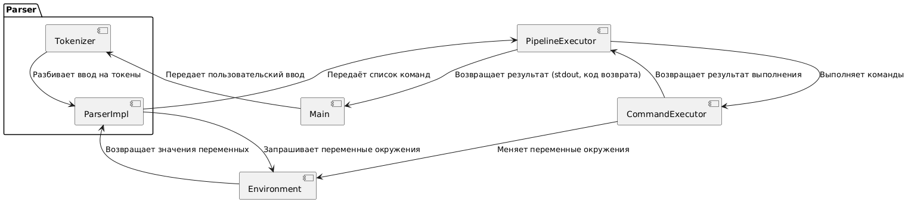
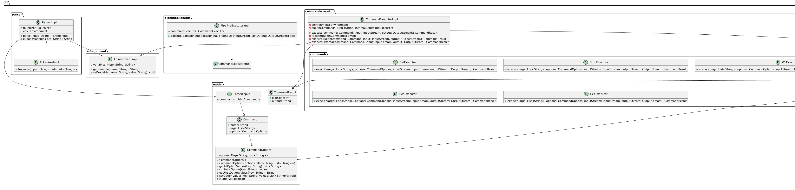
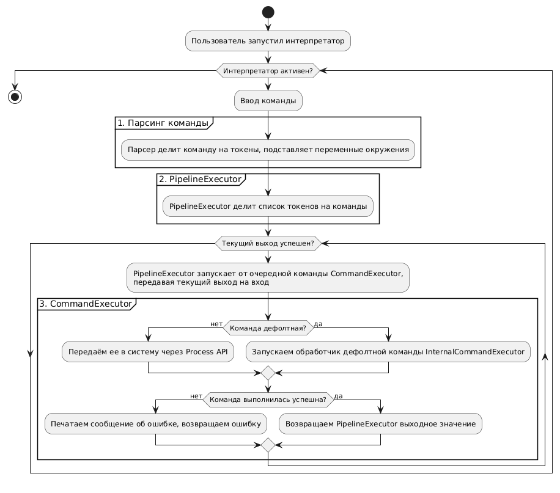

# Архитектурная документация CLI-интерпретатора

## 1. Введение

Документ описывает архитектуру CLI-интерпретатора, предназначенного для обработки и выполнения команд, введенных пользователем в командной строке. Система поддерживает встроенные команды, вызов внешних программ, использование переменных окружения и пайпов.

## 2. Стейкхолдеры и их интересы

- **Пользователи**: Простота использования, поддержка стандартных команд, возможность выполнения сложных команд с использованием пайпов.
- **Разработчики**: Четкость архитектуры, удобство разработки и тестирования, возможность расширения функциональности.

## 3. Отношения между элементами архитектуры

- **Main** взаимодействует с компонентами для разбора ввода и выполнения команд. Передаёт вывод `Parser` в `PipelineExecutor`.
- **Parser** разбирает ввод на токены, выполняет подстановку переменных окружения и собирает структуру `Command`.
- **PipelineExecutor** выполняет цепочку команд с помощью `CommandExecutor`, передавая вывод одной команды на вход следующей.
- **CommandExecutor** выполняет отдельные команды, поддерживая встроенные команды и передавая внешние команды в систему.
- **Environment** хранит и управляет переменными окружения, которые используют `Parser` для подстановки.
- **IOEnvironment** состоит из потоков ввода, вывода и ошибок, используется для удобного обращения с потоками в командах.

## 4. Обоснование архитектуры

Архитектура системы модульная, что упрощает разработку, тестирование и поддержку. Система легко расширяется за счет добавления новых команд и функциональности. Четкое разделение обязанностей между компонентами обеспечивает удобство использования и понимания системы.

## 5. Компоненты системы

### 1. Main

Главный цикл программы. Отвечает за:

- Чтение пользовательского ввода;
- Передачу введенной строки в **Parser**;
- Передачу результата **Parser** в **PipelineExecutor**;

### 2. Parser

Parser разбирает строку ввода и превращает её в список команд с помощью `Tokenizer`. Учитывает:

- Разделение аргументов по пробелам;
- Поддержку одинарных и двойных кавычек (`full`/`weak quoting`);
- Подстановку переменных окружения (`$VAR` → значение из `Environment`);
- Разделение команд по пайпам (`|`);
- Разбор опций команд (`--option=value` и `--flag` без значения);
- Выделение первой лексемы как имени команды, а оставшихся — как аргументов;
- Сбор опций в `CommandOptions`, поддерживающий несколько значений для одной опции;
- Подготовку списка команд (`Command`), содержащих имя, аргументы и опции, для дальнейшей передачи в `PipelineExecutor`.

Процесс работы:

1. `Tokenizer` разбивает строку на токены, учитывая пробелы и кавычки.

    - **Одинарные кавычки (`'...'`)** — содержимое воспринимается буквально.
    - **Двойные кавычки (`"..."`)** — поддерживается интерпретация escape-последовательностей.
    - **Обратный слэш (`\`)** — экранирует специальные символы внутри двойных кавычек.
    - **Пайп (`|`)** — разделяет команды.

2. Первое слово считается именем команды, остальные — аргументами.
3. Опции (`--option=value`) выделяются и сохраняются в `CommandOptions`.
4. Переменные окружения (`$VAR`) заменяются на их значения из `Environment`.
5. Полученный список команд (`Command`) передаётся в `PipelineExecutor`.
6. Команды присваивания переменных окружения (`VAR=value`) интерпретируются как команда с именем `=` и двумя аргументами (`VAR` и `value`).
### 3. PipelineExecutor

- Получает список команд от **Parser**;
- Для каждой команды вызывает **CommandExecutor** в отдельном потоке;
- Передаёт поток вывода одной команды как поток ввода следующей.

### 4. CommandExecutor (интерфейс)

- Определяет единый интерфейс для выполнения команды;
- Поддерживает встроенные команды (`echo`, `cat`, `wc`, `pwd`, `exit`), для каждой такой команды вызывает `execute` конкретной имплементации `InternalCommandExecutor`;
- `exit` завершает работу интерпретатора с кодом выхода, указанным в аргументе (по умолчанию 0)
- Если команда не встроенная — передаёт её в систему через Process API.
- Поддерживает потоки вывода (stdout), ошибок (stderr) и код возврата (exit code);
- Для внешних команд результат выполнения (stdout, stderr, exit code) полностью соответствует поведению вызванного процесса.
- В `CommandExecutor` команда с именем `=` и двумя аргументами обрабатывается как присваивание переменной окружения.

### 5. Environment

- Хранит переменные окружения (`имя=значение`);
- Позволяет изменять и получать переменные;
- Обрабатывает подстановки (`$VAR` → значение переменной).

### 6. InternalCommandExecutor

- Определяет единый интерфейс для выполнения поддерживаемых команд, выполняемых непосредственно интерпретатором;
- Добавление новой встроенной команды - реализация интерфейса;
- Содержит единственный публичный метод, принимающий аргументы и параметры, входной и выходной поток;
- Если команда предполагает возможность чтения из входного потока и позиционные аргументы не переданы, то значение из входного потока используется в качестве позиционного аргумента;
- Выход команды записывается в выходной поток;
- `execute` возвращает код возврата функции;
- Если команда - `exit`, то выбрасывается исключение `ExitCommandException`.

## 6. Принципы работы

1. Пользователь вводит строку.
2. **Parser** разбирает её и превращает в список команд, идущих по порядку.
3. **PipelineExecutor** выполняет команды через `CommandExecutor`.
4. **CommandExecutor** выполняет команды:
    - Если команда встроенная, выполняется соответствующая логика, вызывая метод `execute` соответствующей имплементации `InternalCommandExecutor`;
    - Если команда не встроенная, вызывается внешний процесс.
    - Для каждой команды есть:
        - Потоки входа, выхода и ошибок;
        - Позиционные аргументы;
        - Параметры (опции, например, `--help`);
    - Если позиционные аргументы не переданы, то в качестве позиционных аргументов может быть использован входной поток.
5. Вывод отображается в консоли или передаётся в следующую команду через пайп.
6. Если введена команда `exit`, интерпретатор завершает работу. Обработка команды `exit` выполняется в соответствующей имплементации `InternalCommandExecutor`, выбрасывается исключение, которое ловится и обрабатывается в `Main`.

## 7. **Поддерживаемые возможности**

- Встроенные команды (`cat`, `echo`, `wc`, `pwd`, `exit`).
- Переменные окружения (`VAR=value`, `$VAR`).
- Вызов внешних программ (`git status`).
- Поддержка пайпов (`|`).
- Поддержка кавычек (`full`/`weak quoting`).
- Поддержка стандартных потоков вывода (stdout), ошибок (stderr) и кода возврата (exit code).

## 8. Диаграммы

- **Компонентная диаграмма**: 
- **Диаграмма классов**: 
- **Диаграмма активностей**: 
